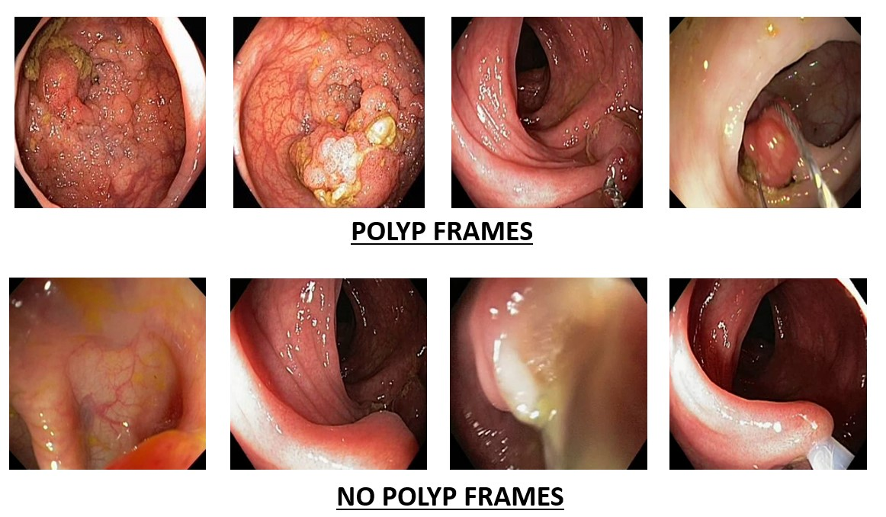

#  ACPI Testing: A Real Time Application To Detect Polyps

## Project Overview
The Automatic Colonoscopy Polyp Identification App is an innovative, real-time application designed to assist medical professionals in the detection of colonoscopy polyps using a fine-tuned, interpretable deep learning model based on the VGG-16 architecture. This app aims to address the issue of selection bias in existing colonoscopy datasets by providing a more robust and accurate tool for automatic colonoscopy polyp detection (ACPD). Through its user-friendly interface, healthcare providers can utilize the app to identify colonoscopy frames as polyp or no-polyp.



## ACPI Testing  App
The [**ACPI Testing metadata**](https://zenodo.org/records/7874340)  has all the metadata related to the work done on Automatic Colonoscopy Polyp Identification. It also contains the APK file for users to download and start utilizing the application.

## Getting Started
These instructions will guide you through setting up and running the app on your local machine.

### Prerequisites
- Flutter SDK: [Installation Guide](https://flutter.dev/docs/get-started/install)
- Dart SDK: Comes with Flutter
- Android Studio or Xcode: For running the app on an emulator or physical device

### Installation 
#### (run these commands in the terminal)
1. Clone the repository:
    ```bash
    git clone https://github.com/misahub2023/FEM-LABELLER.git
    ```
2. Update flutter and its dependencies: 
    ```bash
    flutter upgrade
    ``` 
3. Check whether flutter is ready for use: 
    ```bash
    flutter doctor
    ```
    Resolve any issues shown by flutter doctor before moving to next steps

4. Install the dependencies:
    ```bash
    flutter pub get
    ```

### Running the App
1. Connect your device or start an emulator.
2. Run the app:
    ```bash
    flutter run
    ```

## Files Structure And their purpose
+ android/
    + [app/](android/app) 
        + `src/` (Source files for different build variants)
            + `debug/` 
                + `AndroidManifest.xml` (The manifest file for the debug build variant, specifying application metadata, permissions, and components)
            + `main/` (Source files for the main build variant)
                + `kotlin/com/example/ultasound/`
                    + `MainActivity.kt` (The main entry point for the Android application written in Kotlin)
                + `res/` (Resource files for the app, one can modify the launch screeen backgroud using multiple options available in this folder)
                    + `drawable-v21/` (Drawable resources for API level 21 and above, one can modify the launch screeen backgroud using multiple options available in this directory)
                        + `launch_background.xml` (Defines the launch screen background for the app)
                    + `mipmap-hdpi` (stores different versions of application icons and launcher images)
                    + `values-night/` 
                        + `styles.xml` (Defines styles for the app in night mode)
                    + `values/`
                        + `styles.xml` (Defines styles for the app)
                + `AndroidManifest.xml` (The manifest file for the main build variant, specifying application metadata, permissions, and components)
            + `profile` (Source files for the profile build variant)
                + `AndroidManifest.xml`
        + `build.gradle` (Build configuration file for the app module, specifying dependencies, plugins, and build settings)
    + [gradle/wrapper/](android/gradle/wrapper) (Contains Gradle wrapper files to ensure a specific version of Gradle is used)
        + `gradle-wrapper.properties` (Specifies properties for the Gradle wrapper, such as the Gradle distribution URL)
    + [build.gradle](android/build.gradle) (Top-level build configuration file for the project, specifying project-wide dependencies and build settings)
    + [gradle.properties](android/gradle.properties) (Specifies properties for the Gradle build system, such as JVM options and project properties)
    + [research_project_android.iml](android/research_project_android.iml) (IntelliJ IDEA module file for the project)
    + `[settings.gradle](android/settings.gradle) (Specifies the Gradle settings for the project, including module names and build configurations)

+ ios/
    + [Flutter/](ios/Flutter) (This folder contains Flutter-specific files that are automatically generated and managed by the Flutter framework)
        + `AppFrameworkInfo.plist` (contains metadata about the Flutter framework)
    + [Runner.xcodeproj/](ios/Runner.xcodeproj) (This folder contains the Xcode project files for your IOS app)
        + `project.pbxproj` (project file that describes the targets, build configurations, and file references for your Xcode project)
    +  [Runner.xcworkspace/](ios/Runner.xcworkspace) (This folder contains the workspace settings for your Xcode project)
        + `contents.xcworkspacedata.xml` (ile defines the structure of your Xcode workspace, including references to your project and any dependencies)
    + [Runner/](ios/Runner) (This folder contains the main iOS project files, including the app's source code, assets, and configurations)
        + `Assets.xcassets/` (This folder contains the app's image assets, such as icons and launch images)
            + `AppIcon.appiconset/`
                +  `Contents.json` (A JSON file that describes the structure and properties of the icon set)
            + LaunchImage.imageset/
                +  `Contents.json` (A JSON file that describes the structure and properties of the launch image set)
                + `README.md` (explains steps to modify the launch screen)
        + `Base.lproj/` (This folder contains the storyboard files for the app's user interface)
            + `LaunchScreen.storyboard.xml` (defines the layout and properties of the app's launch screen)
            + `Main.storyboard.xml` (defines the layout and properties of the app's main interface)
        + `AppDelegate.swift` (This file contains the entry point for the iOS app and handles app lifecycle events)
        + `Info.plist` (contains configuration settings for the iOS app, such as app permissions, icons, and other metadata)
        + `Runner-Bridging-Header.h` (used to integrate Swift and Objective-C code)
    + [Podfile](ios/Podfile) (This file is used by CocoaPods to manage your app's dependencies)
+ [assets/](assets) (This folder contains the labels and weights of VGG16 model used in the app) 
+ lib/
    + [utils/](lib/utils) (Utility functions and widgets)
    + [home.dart](lib/home.dart) (implements the functionality for selecting and classifying images using the model)
    + [main.dart](lib/main.dart) (The entry point of the Flutter application)
+ test/
    + [widget_test.dart](test/widget_test.dart) (File for testing the widgets of the app)

#### This application is developed for android devices so for IOS supported app, one must modify the files in `ios` folder according to the details of each file mentioned above.
## Contributing
1. Fork the repository.
2. Create a new branch (`git checkout -b feature/your-feature`).
3. Commit your changes (`git commit -am 'Add your feature'`).
4. Push to the branch (`git push origin feature/your-feature`).
5. Create a new Pull Request.

## Credits
This application was developed as a part of the work published in Handa, Palak, Mangotra, Harshita, and Nidhi Goel. "Effect of selection bias on automatic colonoscopy polyp detection." Biomedical Signal Processing and Control 85 (2023): 104915. The idea was developed by Dr. Palak Handa and Dr. Nidhi Goel. It was executed by Ms. Nikita Garg. A seperate test set was also published which can be checked out here https://zenodo.org/records/7874340. Thanks to Ms. Manya Joshi for developing the github repository of the work. 

